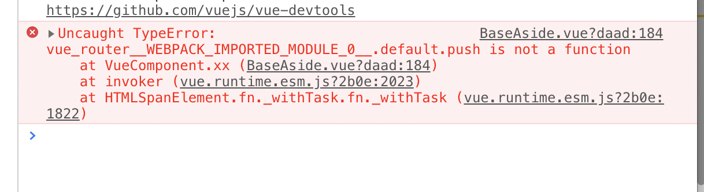

# vue-manage
 
## Project setup
```
npm install  
```

### Compiles and hot-reloads for development
```
npm run serve
```
使用了 vue2.0+less+vue-router+ElementUI
### bug记录
1. 路由命名问题，import的vue-router名字应与import设置路由的route.js名字相同，否则报错如下
解决方案
2. import等路径以相对路径形式写，绝对路径可能报错
3. 修改组件样式无效，用/deep/ 
4. 使用router.push,需要引入自己配置的router文件，而不是'vue-router',且需要以相对路径引入,报错如下

5. vue-router路由参数刷新消失的问题 方法:使用this.$route.query替代以前使用this.$route.params,这样可以解决，不过地址栏带上了有些丑的参数(这个问题带解决)
 
