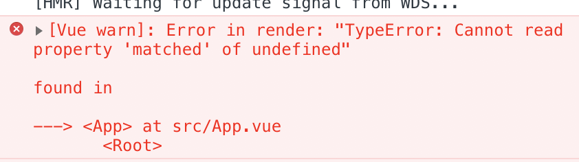
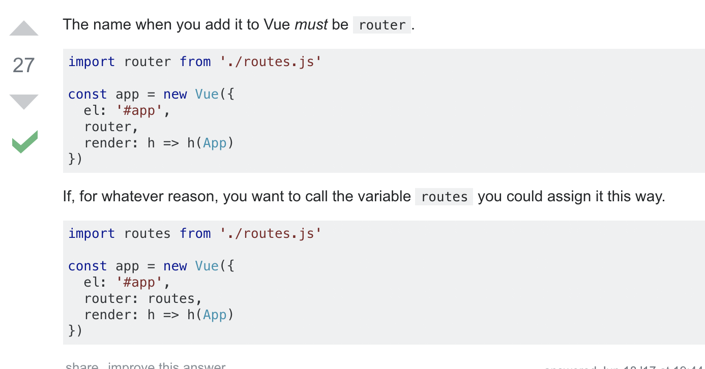

# vue-manage

## Project setup
```
npm install 
```

### Compiles and hot-reloads for development
```
npm run serve
```
使用了 vue2.0+less+vue-router+ElementUI
### bug记录
1. 路由命名问题，import的vue-router名字应与import设置路由的route.js名字相同，否则报错如下
解决方案
2. import等路径以相对路径形式写，绝对路径可能报错
 
 
